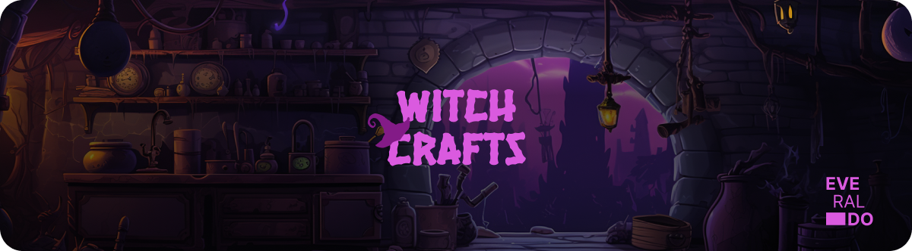

<p align="center">
  
</p>

### 🪄 WITCH CRAFTS

WitchCrafts is a bewitching repository dedicated to the enchanting world of handcrafted<br> components with a spooky twist. Dive into the realm of Halloween magic with a curated collection of meticulously crafted, ghastly-themed creations that are sure to add a touch of mystique to your projects.

## What is inside?

-   [Next](https://nextjs.org/docs)
-   [React](https://reactjs.org)
-   [TypeScript](https://www.typescriptlang.org)
-   [Tailwind](https://tailwindcss.com/)
-   [Framer Motion](https://www.framer.com/motion/)
-   [Eslint](https://eslint.org)
-   [Prettier](https://prettier.io)
-   [Husky](https://github.com/typicode/husky)
-   [Commitlint](https://commitlint.js.org/#/)
-   [Jack-O-Hook](https://github.com/evvvrado/jack-o-hook)

## Instalation

To install this project, follow these steps:

1. Clone the repository to your local machine:

```
- git clone https://github.com/evvvrado/witch-crats.git
```

2. Navigate to the project directory:

```
- cd witch-crafts
```

3. Install the dependencies:

```
- yarn install
```

4. Start the development server:

```
- yarn dev
```

<br>
<br>

> forked from [ectoplate](https://github.com/evvvrado/ectoplate) - @evvvrado
